# W9 GitOps, Observability, SLO and Canary Rollout Evidence

## 1. Overview

This document summarizes the evidence collected for the W9 Cloud/DevOps lab. The lab focuses on GitOps with ArgoCD, observability with Prometheus, SLO validation, alerting, and progressive delivery using Argo Rollouts Canary strategy.

The final evidence is organized into two main folders:

```text
evidence/
├── w9-gitops
└── w9-obs-canary
```

The evidence demonstrates that:

* Kubernetes resources are managed through Git and synchronized by ArgoCD.
* The application can be reproduced from Git.
* ArgoCD self-healing works when the live cluster state drifts from the desired Git state.
* Prometheus collects backend metrics.
* A backend SLO is defined using an Argo Rollouts AnalysisTemplate.
* A real alert is fired and sent to a personal email.
* A good canary version can be promoted successfully.
* A bad canary version can be aborted.
* A bad canary version can also be automatically aborted based on metric analysis.
* Rollback is performed using `git revert`.

---

# Part 1: W9 GitOps Evidence

Folder:

```text
w9-gitops/
```

## 2. ArgoCD installation

Evidence:

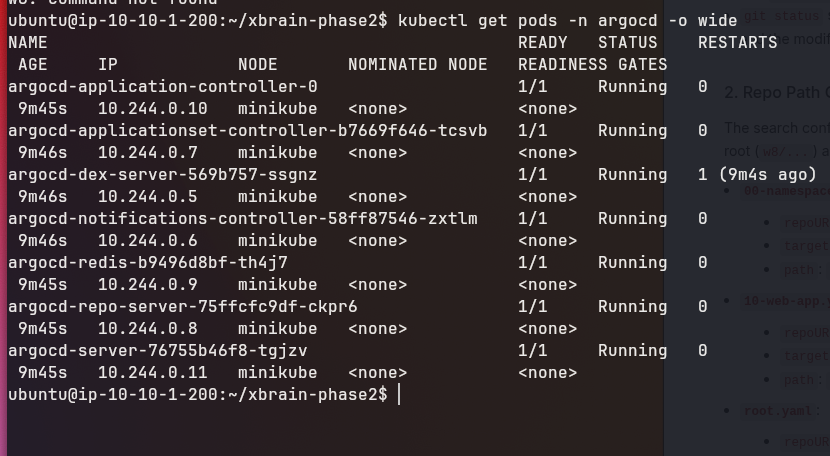

This evidence shows that ArgoCD was installed successfully in the Kubernetes cluster. The ArgoCD components such as the API server, repo server, application controller, Redis, and Dex are running in the `argocd` namespace.

This confirms that the cluster is ready to manage applications using GitOps.

---

## 3. ArgoCD Applications

Evidence:

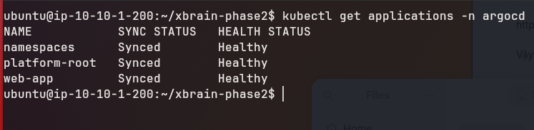

This evidence shows the ArgoCD Applications created through the App-of-Apps pattern.

The expected applications include:

```text
platform-root
namespaces
web-app
kube-prometheus-stack
argo-rollouts
api
```

This proves that the system is managed declaratively from Git and synchronized into the cluster by ArgoCD.

---

## 4. Namespaces created by GitOps

Evidence:

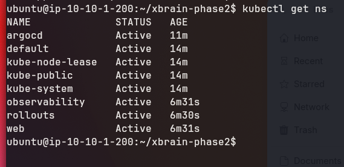

This evidence shows that the required namespaces were created from Git-managed Kubernetes manifests.

The namespaces include:

```text
argocd
web
observability
rollouts
demo
```

This confirms that the cluster structure is reproducible from Git.

---

## 5. Frontend resources in the web namespace

Evidence:

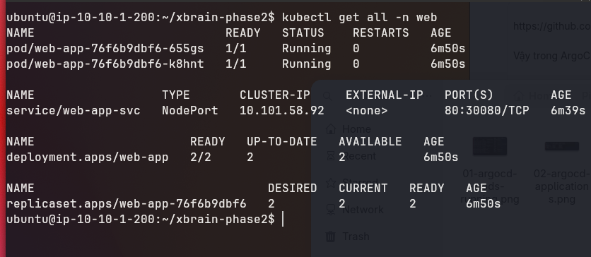

This evidence shows the frontend application resources deployed in the `web` namespace.

The expected resources include:

```text
Deployment
ReplicaSet
Pods
Service
ConfigMap
```

This proves that the frontend application is running in Kubernetes and managed by ArgoCD.

---

## 6. Frontend access through AWS ALB

Evidence:

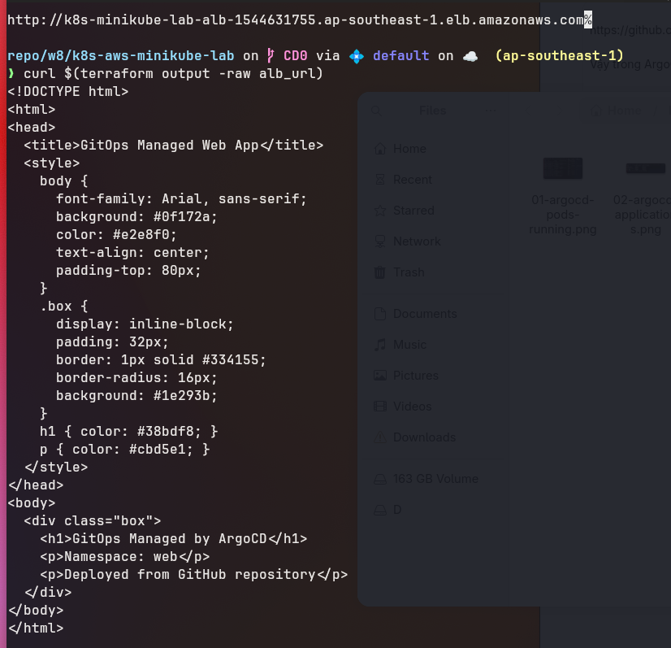
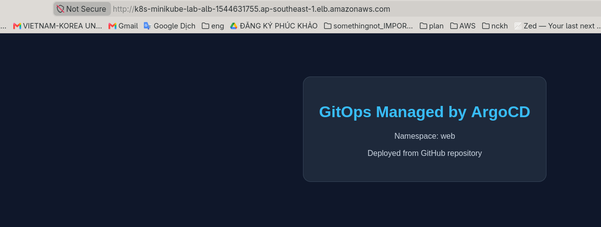

These screenshots show that the frontend application can be accessed through the AWS Application Load Balancer URL.

The traffic flow is:

```text
Browser
  -> AWS ALB
  -> EC2 instance
  -> Minikube NodePort
  -> Kubernetes Service
  -> Frontend Pods
```

This proves that the GitOps-managed frontend application is reachable from outside the cluster through AWS infrastructure.

---

## 7. ArgoCD self-healing test

Evidence:

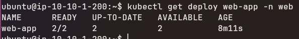

This evidence shows that ArgoCD self-healing works.

The test was performed by changing the live cluster state manually. ArgoCD detected that the live state was different from the desired state in Git and restored the correct state automatically.

This proves that Git remains the source of truth.

---

# Part 2: W9 Observability and Canary Evidence

Folder:

```text
w9-obs-canary/
```

---

## 8. ArgoCD Applications for Observability and Canary

Evidence:

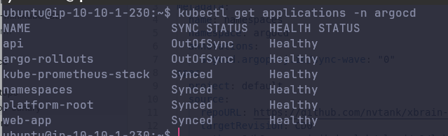

This evidence shows the ArgoCD applications used for the observability and canary rollout lab.

The important applications are:

```text
kube-prometheus-stack
argo-rollouts
api
web-app
platform-root
```

This confirms that the observability stack, Argo Rollouts, and backend API are managed through GitOps.

---

## 9. Observability stack

Evidence:

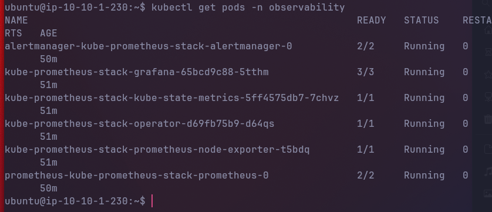

This evidence shows that the observability stack is running in the `observability` namespace.

The expected components include:

```text
Prometheus
Grafana
Alertmanager
Prometheus Operator
```

This proves that the cluster has a monitoring stack for collecting and analyzing metrics.

---

## 10. Argo Rollouts CRDs

Evidence:

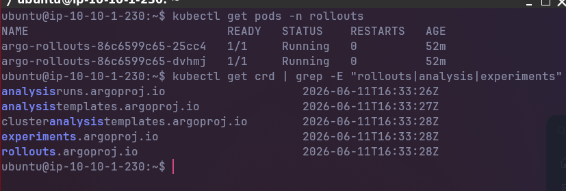

This evidence shows that the Argo Rollouts Custom Resource Definitions were installed successfully.

The expected CRDs include:

```text
rollouts.argoproj.io
analysisruns.argoproj.io
analysistemplates.argoproj.io
experiments.argoproj.io
```

This proves that the cluster supports progressive delivery resources such as Rollout, AnalysisTemplate, and AnalysisRun.

---

## 11. Backend API resources

Evidence:

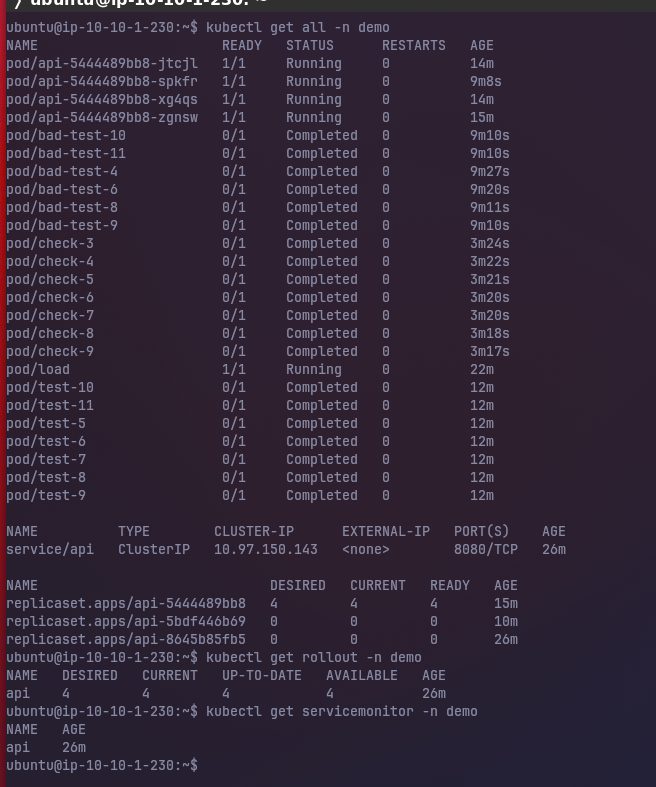

This evidence shows that the backend API is deployed in the `demo` namespace.

The expected resources include:

```text
Rollout
ReplicaSet
Pods
Service
ServiceMonitor
```

This proves that the backend API is deployed using Argo Rollouts and exposed internally through a Kubernetes Service.

---

## 12. Backend API stable version

Evidence:

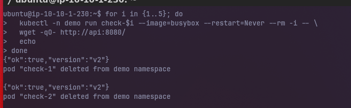

This evidence shows that the backend API is running the stable version:

```text
version: v2
```

This confirms the stable baseline before testing canary rollout and failure injection.

---

## 13. Prometheus API metrics

Evidence:

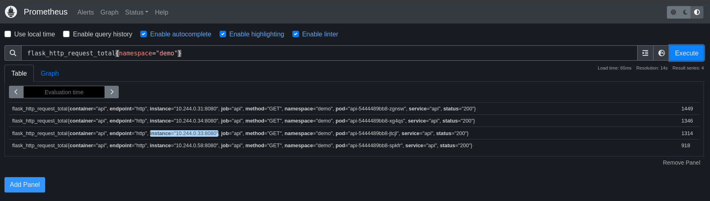

This evidence shows that Prometheus successfully collects metrics from the backend API.

The backend exposes metrics through `/metrics`, and Prometheus scrapes them through the ServiceMonitor.

This proves that the backend API is observable and that its metrics can be used for analysis.

---

# Part 3: SLO and Alert Evidence

## 14. Backend SLO definition

Evidence:

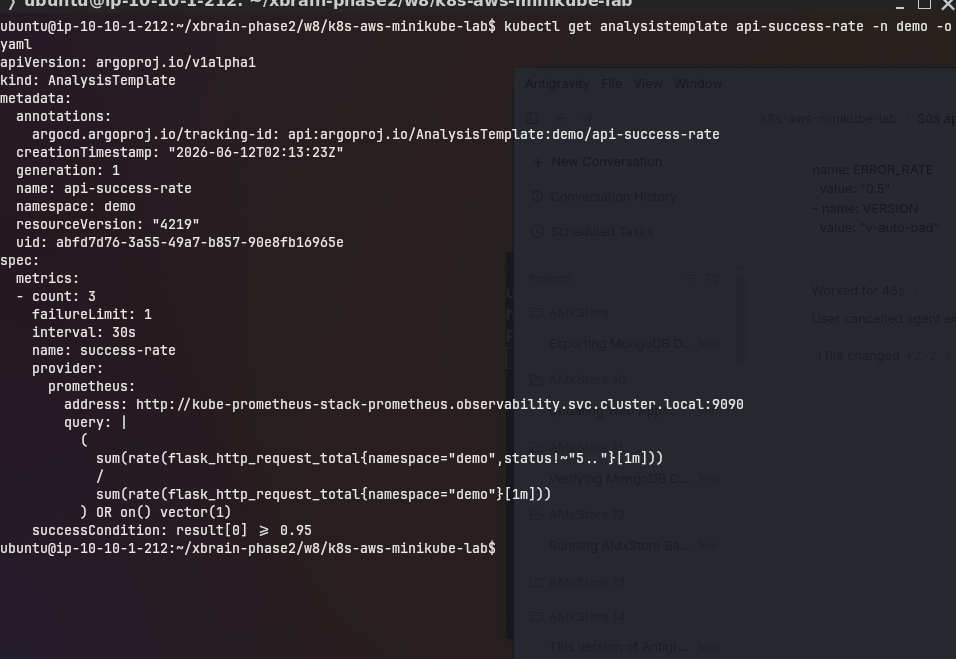

This evidence shows the backend SLO defined using an Argo Rollouts AnalysisTemplate.

The SLO is:

```text
Backend success rate >= 95%
```

The Prometheus query calculates the success rate using backend request metrics:

```promql
(
  sum(rate(flask_http_request_total{namespace="demo",status!~"5.."}[1m]))
  /
  sum(rate(flask_http_request_total{namespace="demo"}[1m]))
) OR on() vector(1)
```

The success condition is:

```yaml
successCondition: result[0] >= 0.95
```

This means the canary version is considered healthy only if at least 95% of requests are successful.

---

## 15. CloudWatch SLO alert configuration

Evidence:

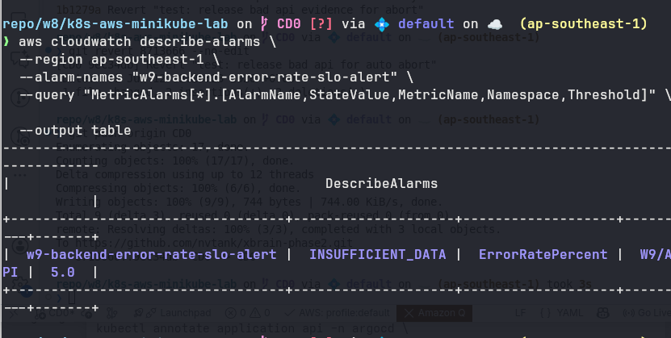

This evidence shows a CloudWatch Alarm configured for alerting.

The alarm is used to demonstrate the alerting flow:

```text
Metric
  -> CloudWatch Alarm
  -> SNS Topic
  -> Personal Email
```

This proves that the system has an alerting mechanism connected to email notification.

---

## 16. Email subscription confirmation

Evidence:

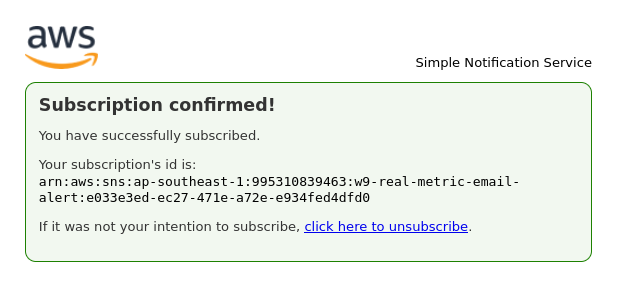

This evidence shows that the email subscription for SNS was confirmed.

Without confirmation, SNS cannot send alert emails to the personal email address. This evidence proves that the email endpoint is active and ready to receive alerts.

---

## 17. CPU load used to trigger CloudWatch Alarm

Evidence:

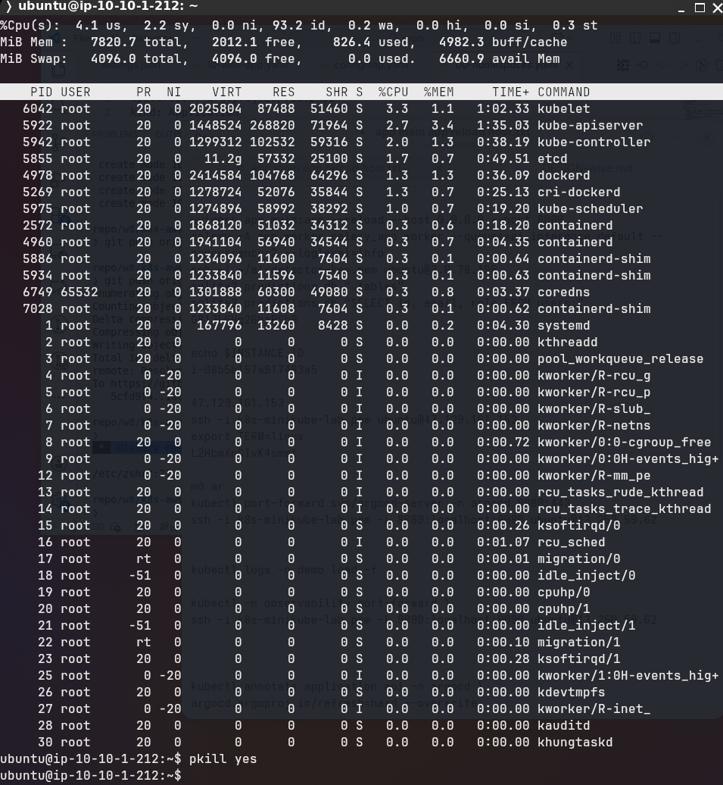

This evidence shows CPU load being generated on the EC2 instance.

The CPU load was used to trigger a real CloudWatch metric alarm.

This proves that the alert was based on real AWS metric data, not a fake or hardcoded email.

---

## 18. CloudWatch Alarm in ALARM state

Evidence:

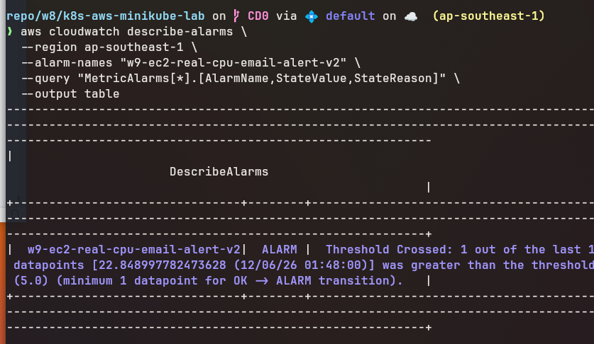

This evidence shows that the CloudWatch Alarm entered the `ALARM` state.

This proves that the configured threshold was breached and the alert was triggered successfully.

---

## 19. Alert email received

Evidence:

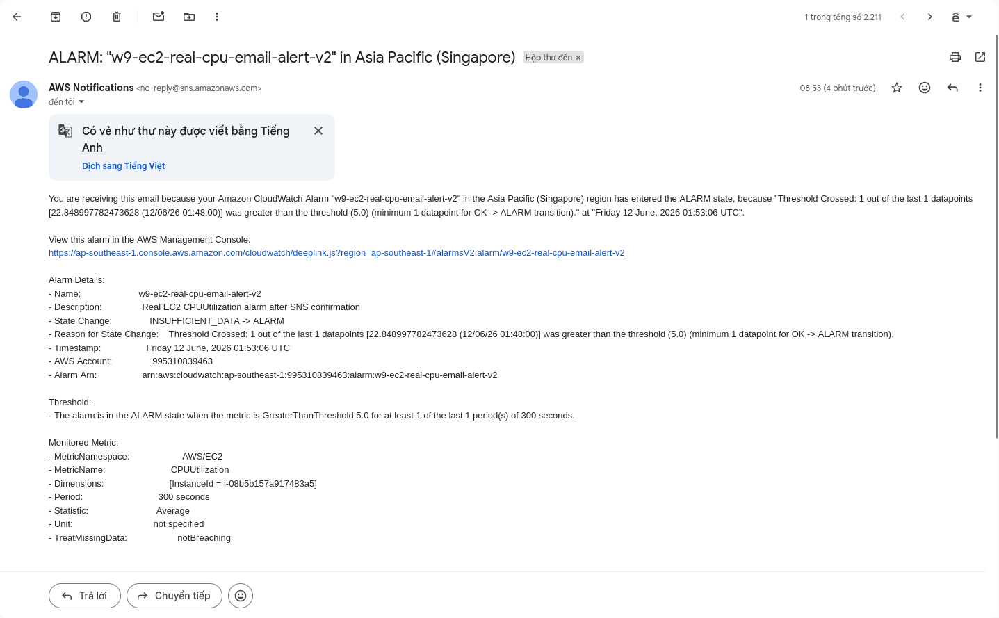

This evidence shows that the alert email was received in the personal Gmail inbox.

This proves that the full alerting flow works:

```text
CloudWatch Alarm
  -> SNS
  -> Email
```

---

# Part 4: Canary Rollout Evidence

## 20. Good canary release paused at 25%

Evidence:

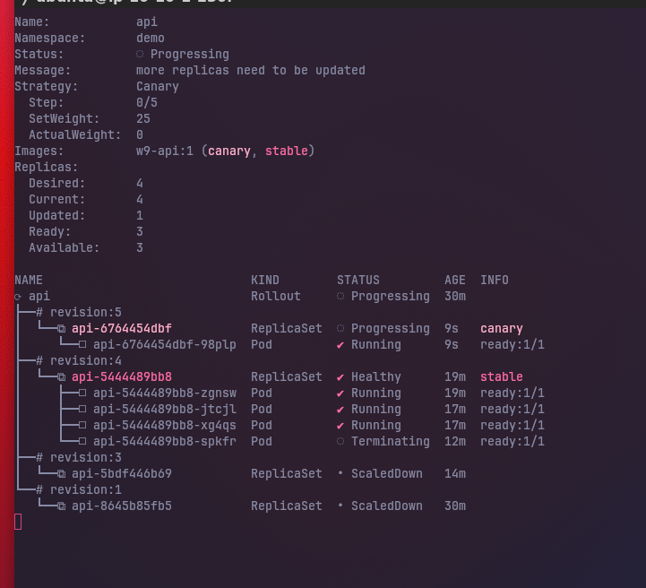

This evidence shows that a new good version was released using Canary strategy and paused at 25% traffic.

This proves that Argo Rollouts does not immediately move a new version to 100% traffic.

---

## 21. Good canary promoted to 100%

Evidence:

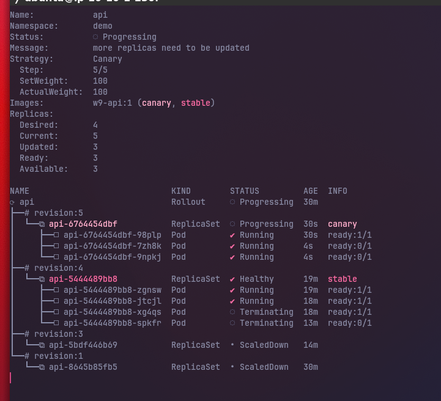

This evidence shows that the good canary version was promoted successfully to 100%.

This proves that a healthy version can be gradually released and then promoted to become the stable version.

---

## 22. Bad canary release paused at 25%

Evidence:

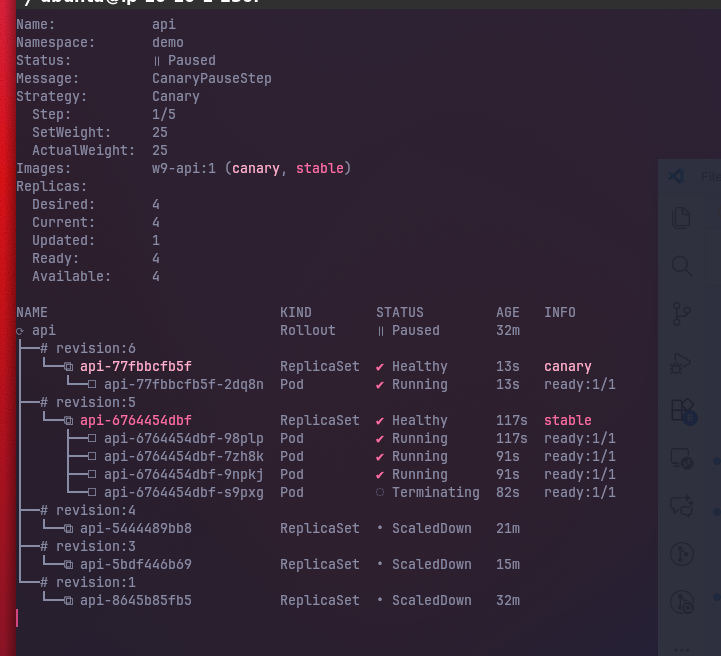

This evidence shows that a bad version was released as a canary and only received partial traffic.

The bad version was configured with an injected error rate.

This proves that the bad version was controlled by the canary strategy and was not immediately promoted to full traffic.

---

## 23. Bad version returns HTTP 500

Evidence:

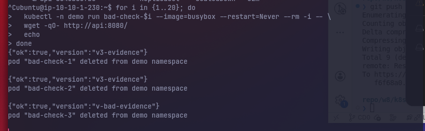

This evidence shows that the bad version returned HTTP 500 errors.

This proves that the injected failure was working and that the canary version was unhealthy.

---

## 24. Bad version aborted manually

Evidence:

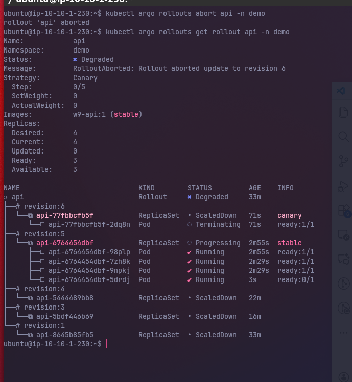

This evidence shows that the bad canary version was aborted and did not become the stable version.

This confirms the rollback behavior of Argo Rollouts when a bad release is detected.

---

# Part 5: Automatic Canary Abort by SLO Analysis

## 25. API healthy before auto-abort test

Evidence:

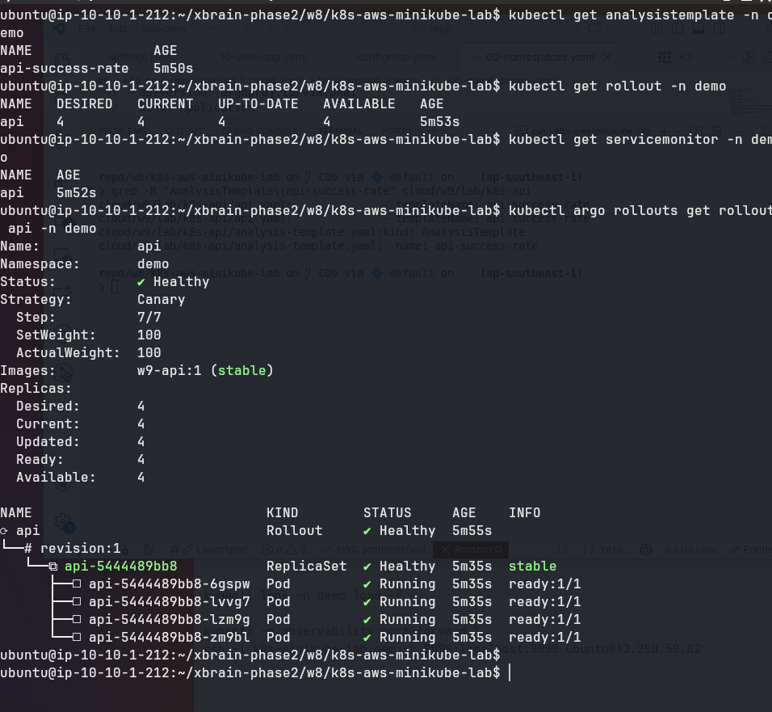

This evidence shows that the API was healthy before testing automatic abort.

The stable version was running normally before injecting the bad version.

---

## 26. Load generator running

Evidence:

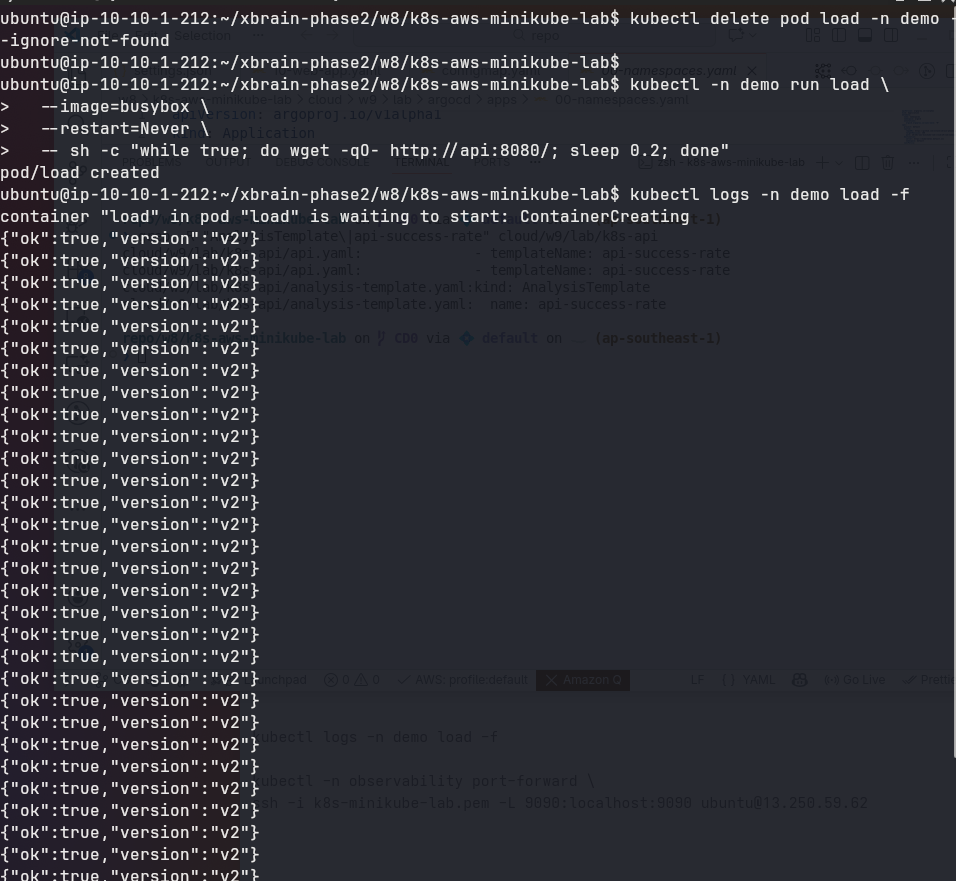

This evidence shows that a load generator was sending continuous traffic to the backend API.

This is required so that Prometheus can collect enough request metrics for the AnalysisTemplate.

---

## 27. Commit for bad API auto-abort test

Evidence:

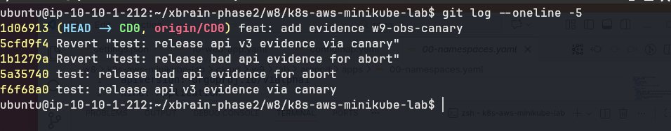

This evidence shows the Git commit used to release the bad API version for the auto-abort test.

The bad version was configured with:

```text
ERROR_RATE=0.5
VERSION=v-auto-bad
```

This proves that the test was triggered through Git, following GitOps principles.

---

## 28. Automatic abort rollout result

Evidence:

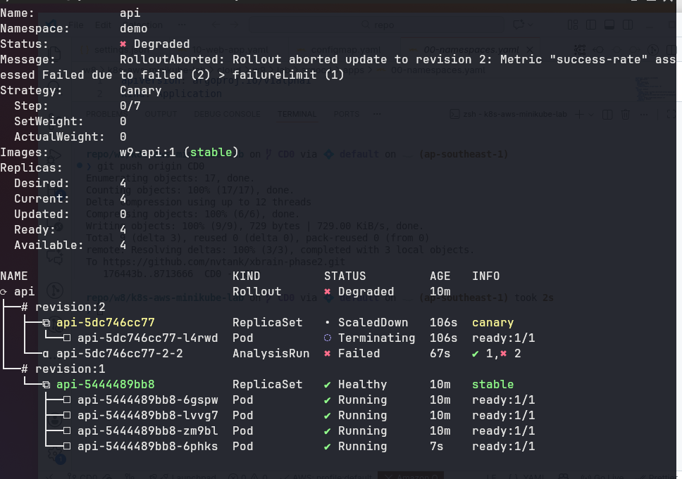

This evidence shows that the bad canary version was automatically aborted.

The important indicators are:

```text
RolloutAborted
Metric "success-rate" Failed
Bad canary ReplicaSet ScaledDown
Stable ReplicaSet still Healthy
```

This proves that Argo Rollouts used the AnalysisTemplate result to automatically abort the unhealthy canary release.

---

## 29. AnalysisRun failed

Evidence:

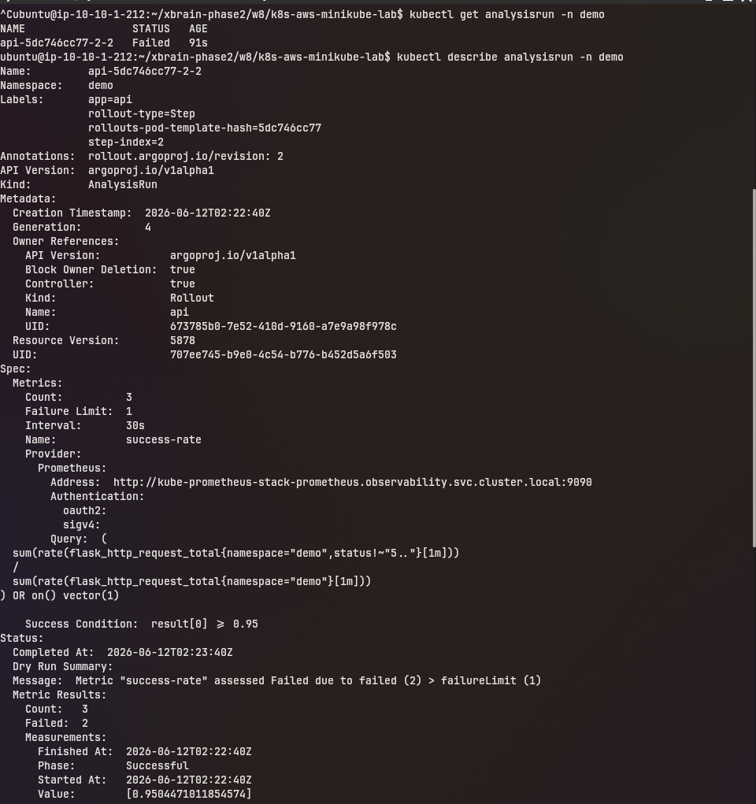

This evidence shows that the AnalysisRun failed because the `success-rate` metric did not satisfy the SLO condition.

This proves that the automatic abort was driven by metric analysis, not by a manual abort command.

---

## 30. API remains stable after auto-abort

Evidence:

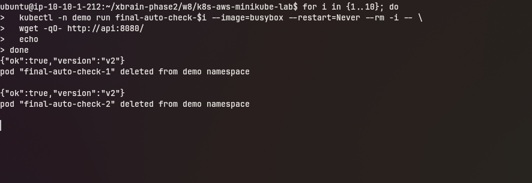

This evidence shows that after the bad canary was automatically aborted, the API still served the stable version:

```text
version: v2
```

This proves that the failed canary did not replace the stable version.

---

# Part 6: Rollback Evidence

## 31. Final API healthy

Evidence:

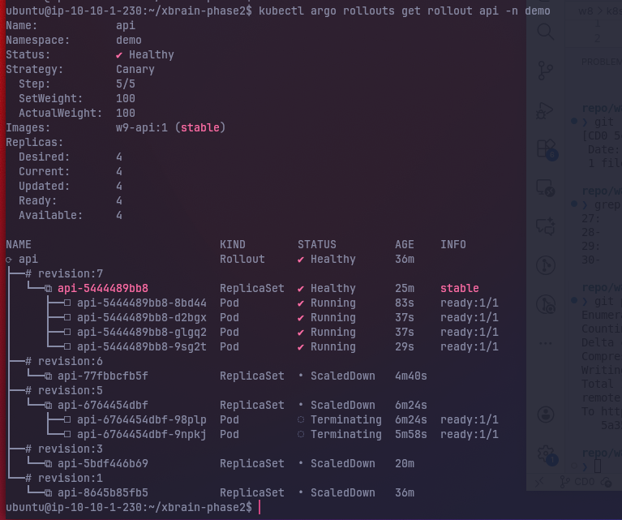

This evidence shows that the API returned to a healthy state after testing the failed canary release.

The final stable version is:

```text
version: v2
```

---

## 32. Git rollback commits

Evidence:

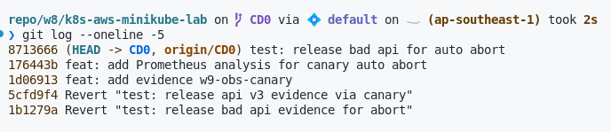

This evidence shows the Git history containing test commits and revert commits.

This proves that rollback was performed using Git, which is the correct approach in a GitOps workflow.

The purpose of `git revert` is to restore the desired state in Git after testing a bad release.

---

# Part 7: Final Mapping to Requirements

| Requirement                                                    | Evidence                                                                                                                                       |
| -------------------------------------------------------------- | ---------------------------------------------------------------------------------------------------------------------------------------------- |
| Changes are made through Git and synchronized by ArgoCD        | `w9-gitops/02-argocd-applications.png`, `w9-obs-canary/03-commit-bad-api-auto-abort.png`                                                       |
| System can be reproduced from Git                              | `w9-gitops/03-namespaces-created.png`, `w9-gitops/04-web-namespace-resources.png`, `w9-obs-canary/04-api-resources-demo.png`                   |
| ArgoCD self-healing works                                      | `w9-gitops/07-self-heal-test.png`                                                                                                              |
| Backend metrics are collected by Prometheus                    | `w9-obs-canary/06-prometheus-api-metric.png`                                                                                                   |
| One SLO is defined                                             | `w9-obs-canary/slo-analysis-template-query.png`                                                                                                |
| One alert fires and is sent to personal email                  | `w9-obs-canary/04-cloudwatch-alarm-state-alarm.png`, `w9-obs-canary/05-gmail-received-cloudwatch-alarm.png`                                    |
| Good canary version can be promoted                            | `w9-obs-canary/07-canary-v3-paused-25.png`, `w9-obs-canary/08-canary-v3-promoted-100.png`                                                      |
| Bad canary version can be aborted                              | `w9-obs-canary/09-bad-canary-paused-25.png`, `w9-obs-canary/10-bad-version-error-500.png`, `w9-obs-canary/11-bad-version-aborted.png`          |
| Bad canary version is automatically aborted by metric analysis | `w9-obs-canary/04-auto-abort-rollout.png.png`, `w9-obs-canary/05-analysisrun-failed.png`, `w9-obs-canary/06-api-still-v2-after-auto-abort.png` |
| Rollback is done through Git revert                            | `w9-obs-canary/13-git-log-rollback-commits.png`, `w9-obs-canary/12-final-api-healthy.png`                                                      |

---

# 8. Conclusion

The evidence proves that the W9 lab was completed with the following results:

* ArgoCD was installed and used to manage Kubernetes applications through GitOps.
* Namespaces, frontend resources, backend API, observability stack, and rollout components were created from Git-managed manifests.
* The frontend application was exposed successfully through AWS ALB.
* Prometheus collected backend API metrics.
* A backend SLO was defined as success rate greater than or equal to 95%.
* A CloudWatch Alarm fired and sent an alert to a personal email through SNS.
* A good canary version was promoted successfully.
* A bad canary version returned HTTP 500 errors and was aborted.
* A bad canary version was also automatically aborted by Argo Rollouts based on failed SLO analysis.
* The stable version remained available after the failed canary.
* Rollback was handled using `git revert`, keeping Git as the source of truth.
